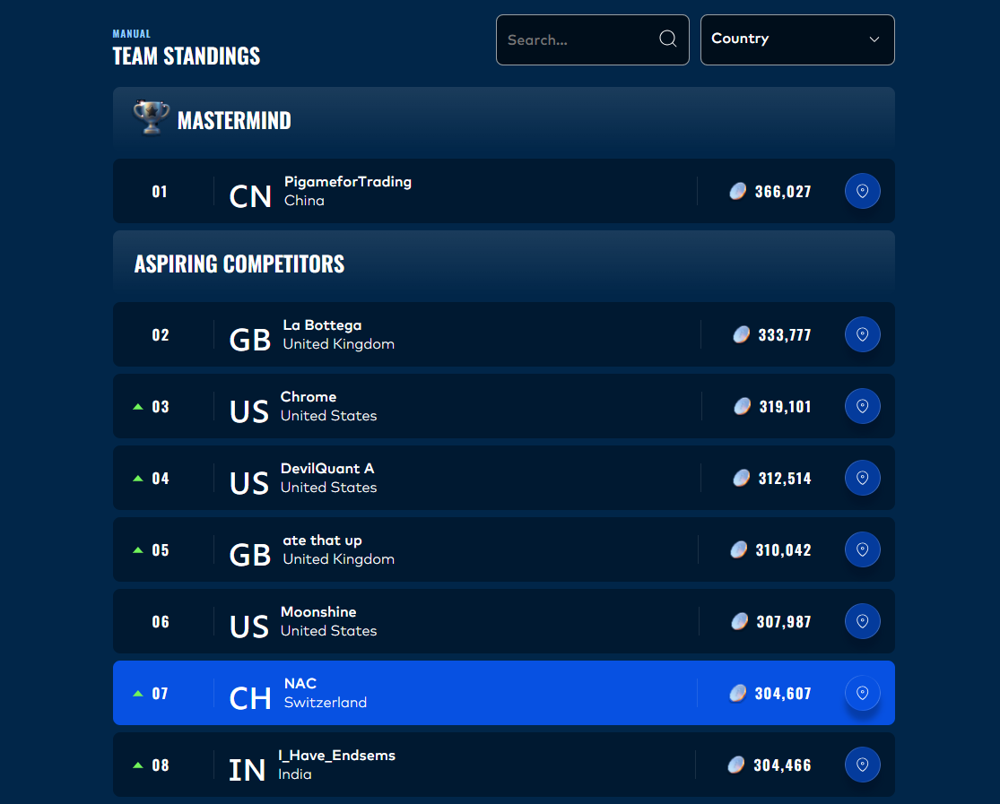

# IMC Prosperity 4 — Team NAC

### 7th Place · Manual Trading · 304,607 XIRECs · Out of 18,803 Teams

[IMC Prosperity](https://prosperity.imc.com/) is a global trading competition hosted by IMC Trading. It spans multiple rounds, each presenting unique scenarios where participants make trading decisions under uncertainty. The competition has two components — algorithmic trading and manual trading. This repository covers our approach to the **manual trading** side.

  

---

## Purpose

This repository is meant to serve as a **guide for future competitors**. Whether you're preparing for Prosperity 5 or any similar trading competition, the round-by-round breakdowns cover the types of problems you can expect, how to approach them, and the reasoning that helped us finish in the top 7.

---

## Competition Structure

In Prosperity 4, the first two rounds served as **qualification only** and did not count toward the final manual trading leaderboard. Rounds 3 through 5 determined the final standings.

---

## Round Writeups

Each round has its own detailed writeup covering the instructions, our strategy, and the final results.

| Round | Link |
|-------|------|
| Round 3 | [View Writeup →](round3/README.md) |
| Round 4 | [View Writeup →](round4/README.md) |
| Round 5 | [View Writeup →](round5/README.md) |

---

## About

Team NAC is a two-person team from Switzerland. This repository serves as a record of our manual trading approach — what we did, why we did it, and the results we achieved.

