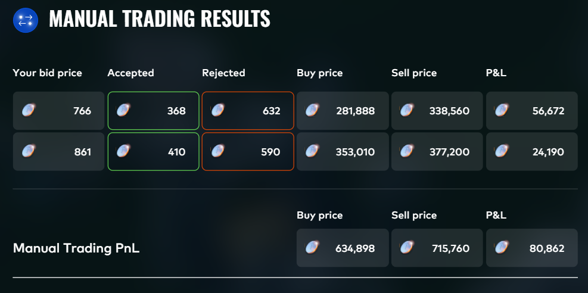
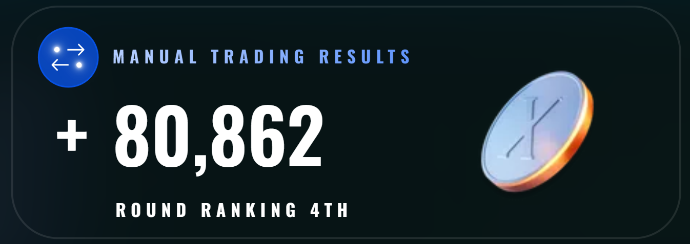
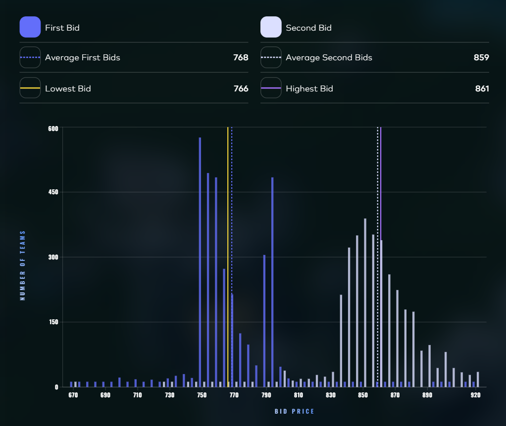
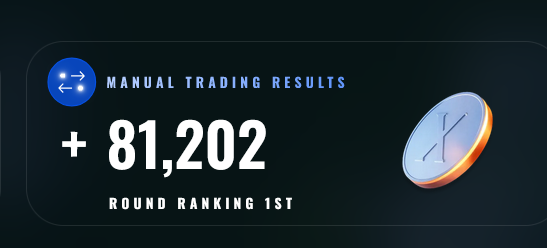
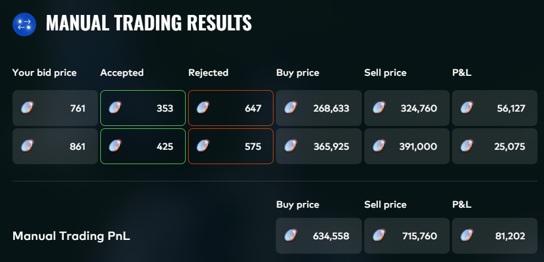

# Round 3 — "Gloves Off"

## Instructions

We trade against a secret number of counterparties that all have a reserve price ranging between 670 and 920. We trade at most once with each counterparty. On the next trading day, we're able to sell all the product for a fair price of 920.

The distribution of the reserves is uniformly distributed at increments of 5 between 670 and 920 (inclusive on both ends). Counterparties may have reserve prices at 675 and 680, but not at 676, 677, 678, 679, etc.

We submit two bids ($670 \le b_1 \le b_2 \le 920$, integers only).

- **Bid 1:** If our first bid is higher than a counterparty's reserve price, we trade with them at our first bid.

- **Bid 2 (above average):** If our second bid is higher than the reserve price and higher than the mean of all players' second bids, we trade at our second bid.

- **Bid 2 (below average):** If our second bid is higher than the reserve price but lower than or equal to the mean of all players' second bids, the chance of a trade rapidly decreases. We trade at our second bid but our PnL is penalized by:

$$\left(\frac{920 - \bar{b}_2}{920 - b_2}\right)^3$$

where $\bar{b}_2$ is the mean of all players' second bids.

## Game Plan

For this challenge, we realized early on that once we had a good estimate of the average bid 2, finding the optimal submission was fully deterministic. The entire problem boiled down to one thing: estimating the average $b_2$ as accurately as possible.

We started by computing the Nash equilibrium, which landed at **(751, 836)**. This was also shared on Discord, and since every remaining team had passed the qualification round, we assumed most players were serious enough to either derive Nash themselves or find it there.

From there we noticed something important about the structure of the problem. Reserve prices sit on a grid of 5, which means the only rational $b_2$ values are 836, 841, 846, 851, 856, and so on. You need to bid strictly above a reserve price to capture that pod, so bidding 837 through 840 gets you the exact same pods as 836 but at a higher cost. Most rational players would land on one of these sweet spots.

We looked at past Prosperity editions to calibrate how players tend to bid relative to Nash. In P2 and P3, averages landed about 1 to 2 above Nash. But those editions had no qualification phase — meaning more casual players — and their reserves were continuous. In our discrete setup, "Nash+1" doesn't exist as a meaningful bid. The first real step above Nash is 841.

*Note: the optimal bid can technically land off a sweet spot if you know the average exactly — in practice this doesn't matter. You can't pinpoint the average precisely enough for that to be useful. Given any realistic range of uncertainty, a sweet spot always wins because you get the same pods for less cost across the entire range where you're above average.*

The penalty asymmetry sealed our thinking. If you bid 841 and the average turns out to be 846, you lose 253 to the cubic penalty. If you bid 846 and the average turns out to be 841, you miss out on just 11. That's a **23:1 ratio**. Overshooting is almost free, undershooting is brutal. Combined with a qualified player base that would skew above Nash, we were confident the average would land well above 836.

## Our Submission

We modeled three distributions of player second bids based on our reasoning about the player base, the penalty structure, and what we picked up on Discord. All three assumed most players would bid on discrete sweet spots above Nash (836), with the main question being how far above.

**Aggressive case** (avg = 851.0)

| $b_2$ | Share |
|------:|------:|
| 836 | 8% |
| 841 | 15% |
| 846 | 20% |
| 851 | 22% |
| 856 | 17% |
| 861 | 8% |
| 866 | 4% |
| 871 | 3% |
| 876 | 1.5% |
| 881 | 0.5% |
| 900 | 0.5% |
| 920 | 0.5% |

**Base case** (avg = 857.1)

| $b_2$ | Share |
|------:|------:|
| 836 | 5% |
| 841 | 8% |
| 846 | 13% |
| 851 | 18% |
| 856 | 18% |
| 861 | 14% |
| 866 | 9% |
| 871 | 5% |
| 876 | 3% |
| 881 | 2% |
| 886 | 1.5% |
| 891 | 1% |
| 900 | 1.5% |
| 920 | 1% |

**Conservative case** (avg = 859.0)

| $b_2$ | Share |
|------:|------:|
| 836 | 4% |
| 841 | 6% |
| 846 | 10% |
| 851 | 15% |
| 856 | 18% |
| 861 | 18% |
| 866 | 12% |
| 871 | 6% |
| 876 | 4% |
| 881 | 2% |
| 886 | 1.5% |
| 891 | 1% |
| 900 | 1.5% |
| 920 | 1% |

Across all three scenarios the optimal sweet spot was either **(761, 851)** or **(761, 861)**. Since two out of three cases pointed to 861, and the downside of bidding 861 when the average was actually 851 was minimal compared to bidding 851 when the average was 859, we submitted **(761, 861)**.

We then adjusted $b_1$ from 761 to **766**. Our conservative case put the average at 859, close enough to 861 that there was a real chance the average could land just above our $b_2$. When the average exceeds 861, bid 2 pods get penalized, making them worth less. In that scenario a higher $b_1$ is better because it shifts more pods to bid 1 where there's no penalty. At (761, 861) vs (766, 861) the profit is identical when the average is at or below 861, but if the average overshoots to 865 or higher, 766 recovers an extra 11 to 23. There's no downside to 766, only upside in the tail.

**Final submission: (766, 861).**

## Results

We ended up ranking **4th** in this round with a PnL of **+80,862 XIRECs**.

  

  

Here is the distribution of player bids:

  

The distribution was extremely close to what we predicted — the average $b_2$ landed at **859**, right in line with our conservative case estimate of 859.0.

Our submission was very close to optimal and we left very few XIRECs on the table. We managed to find the best submission on Discord:

  

  

Both us and #1 bid $b_2$ = 861, both above the average of 859, so neither got penalized. The difference comes entirely from $b_1$. They bid 761, we bid 766.

Per price point, both strategies give identical profit (4201). But the counterparties aren't evenly distributed across price points. It's random. This is something we simply regarded as noise. By bidding 766 instead of 761, we moved the pods at the 765 reserve price from bid 2 (earning 59 each) to bid 1 (earning 154 each). That sounds good, but it turns out there were only about 15 counterparties at 765, while other price points in the $b_2$ range had more. The uneven distribution slightly favored their split over ours.

The gap is only 340 though. Essentially noise from the random counterparty allocation. Our $b_1$ adjustment to 766 was designed to be free insurance: with evenly distributed counterparties, both (761, 861) and (766, 861) yield the exact same profit when the average lands at or below 861. The only reason it "cost" us anything is the randomness in how many counterparties sat at each price point.

Looking back, we are still happy we took the extra insurance even though it didn't end up paying off.
