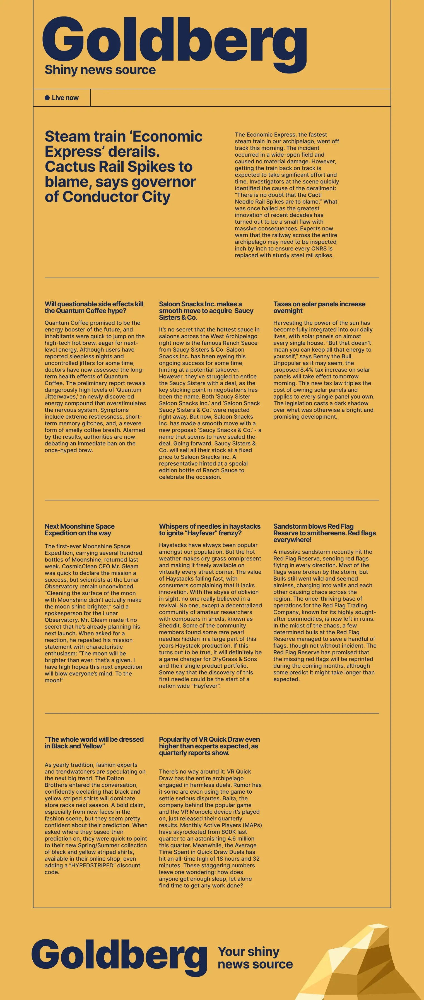
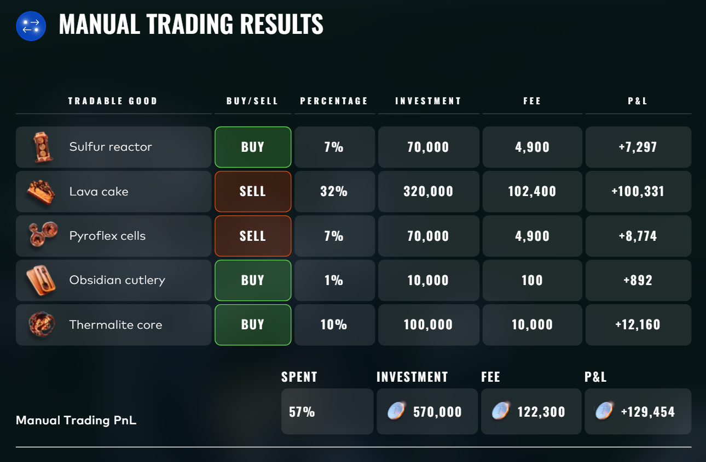
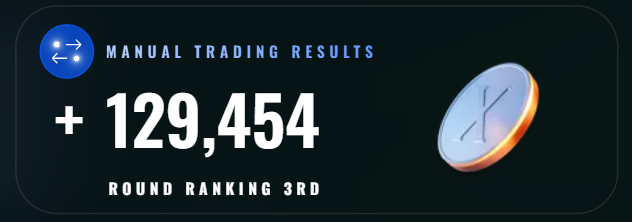

# Round 5

## Instructions

You trade on the Ignith exchange for one day with a budget of **1,000,000 XIRECs** and access to the **Ashflow Alpha** news source, which publishes one article per tradable good.

**Tradable goods:** Obsidian Cutlery, Pyroflex Cells, Thermalite Core, Lava Cake, Magma Ink, Scoria Paste, Ashes of the Phoenix, Volcanic Incense, Sulfur Reactor.

**Decisions:** For each product, choose **Buy**, **Sell**, or **Skip**, and allocate an integer percentage of your budget (0–100%). You can allocate less than 100% total — unused budget expires worthless. You cannot exceed 100%.

**Fee formula:**

```
fee = (percentage / 100)² × 1,000,000
```

Fees are quadratic — each additional percentage point costs more than the last. Allocating 20% to a product costs 40,000 in fees regardless of the return.

**PnL per product:**

```
PnL = investment × return - fee
```

For example, allocating 10% to a product that goes up 20% yields: 100,000 × 0.20 - 10,000 = **10,000**.

**How returns are determined:** The admins pre-define a return range and anchor for each product. Player submissions shift the actual return within that range — if most people buy, the return moves toward the upper bound. This correction is not large; the return is primarily driven by the admins' interpretation of the news.

**The news articles we received:**

<p align="center">
  
</p>

## Game Plan

This round was straightforward compared to the game theory rounds. There's no interaction between products, no hidden mechanics to reverse-engineer — the only edge comes from predicting each product's return as accurately as possible. Once you have a return estimate for each good, the optimal allocation is fully deterministic.

The net PnL for each product is:

$$\text{PnL}_i = \frac{p_i}{100} \cdot B \cdot |r_i| - \left(\frac{p_i}{100}\right)^2 \cdot B = B \left(\frac{p_i |r_i|}{100} - \frac{p_i^2}{10000}\right)$$

where $B = 1{,}000{,}000$, $p_i$ is the integer percentage allocated, and $r_i$ is the signed return. Since each product's PnL depends only on its own allocation, the total profit is a sum of independent concave quadratics:

$$\max_{p_1, \dots, p_9 \in \mathbb{Z}_{\geq 0}} \sum_{i=1}^{9} \left(10{,}000 \cdot p_i \cdot |r_i| - 100 \cdot p_i^2\right) \quad \text{s.t.} \quad \sum_{i=1}^{9} p_i \leq 100$$

Given our return estimates, this has a closed-form solution: $p_i^* = 50 \cdot |r_i|$ (rounded to the nearest integer), with the direction set by the sign of $r_i$. In practice the budget constraint doesn't bind, so each product is optimized independently.

The real challenge is the prediction step. To help us, we calibrated our estimates using data from Prosperity 2 and 3, where we had both the news articles and the actual realized returns. This gave us a sense of how the admins historically translated different types of news into return magnitudes.

## Useful Resources

To calibrate our return predictions, we used the manual trading challenges from Prosperity 2 and Prosperity 3 as reference points. Both rounds followed the same structure — a news source with one article per product, a quadratic fee formula, and a one-day holding period. Since we have the original news articles and the actual realized returns for both rounds, we can study how the admins historically mapped different types of news sentiment into return magnitudes.

### Prosperity 2 — Round 5 (Iceberg News Source)

<p align="center">
  
</p>

```python
actual_returns = {
    "Refrigerators": 0.021,
    "Earrings": 0.124,
    "Blankets": -0.329,
    "Sleds": -0.283,
    "Sculptures": 0.196,
    "PS6": 0.310,
    "Serum": -0.816,
    "Lamps": 0.0001,
    "Chocolate": -0.0004,
}
```

### Prosperity 3 — Round 5 (Goldberg Shiny News Source)

<p align="center">
  
</p>

```python
actual_returns = {
    "Haystacks": -0.0048,
    "Ranch_sauce": -0.0072,
    "Cacti_Needle": -0.412,
    "Solar_panels": -0.089,
    "Red_Flags": 0.509,
    "VR_Monocle": 0.224,
    "Quantum_Coffee": -0.6679,
    "Moonshine": 0.03,
    "Striped_shirts": 0.0021,
}
```

## Predictions

Our goal is to produce three return estimates per good — conservative, base, and aggressive — reflecting the plausible range of outcomes. The base estimate is our best guess; conservative and aggressive bound the range in each direction.

### Obsidian Cutlery

> *"A large-scale manufacturing facility suspended obsidian cutlery production after completed blades sliced through portions of the chemical assembly line used to process them. The breach triggered level 1 contamination protocols and a temporary evacuation of the site. Factory officials declined to comment, while industry experts warned the incident could have implications for other manufacturing facilities."*

The signal is ambiguous. The cutlery cut through the assembly line, and the product being "too sharp" can be read as a flaw or as proof of quality. We decided to treat this as neutral and only focused on the mild supply reduction from the production halt. However, "a large-scale manufacturing facility" is just one facility — others are presumably still operating, so the supply impact is limited. There is no consumer recall, no sales halt, and no health review. Freshness is also unclear with no explicit timing language like "today" or "just announced."

Historical analogues (Sculptures +20%, Red Flags +51%) had unambiguous supply destruction with intact demand, making them stronger signals.

**Prediction: conservative 0%, base +3%, aggressive +10%.**

---

### Pyroflex Cells

> *"The Ignith Tax Authority is facing mounting pressure from energy-sector representatives following its decision to discontinue the Pyroflex Cell Tax Cut, effective tomorrow. The effectiveness of the 50% PCTC, introduced to stimulate the Pyroflex transition, has been the subject of increasing public criticism in recent months. In response, the Tax Authority has moved to abolish the measure, aligning with growing calls to end the financial incentive. Industry groups argue that the abrupt cancellation of the cut, which effectively doubles the current levy, will disrupt consumer upgrade cycles and slow new purchases."*

One of the clearest signals in the round. The tax cut is abolished effective tomorrow, which doubles the levy on Pyroflex Cells. "Effective tomorrow" is a textbook strong one-day mechanism — the price impact is immediate and unavoidable. The product sits between discretionary and essential: it's part of an energy transition but not yet embedded in daily life the way solar panels were in P3.

Importantly, the tax doubles here rather than triples, which is less severe than both historical analogues. Sleds (P2) tripled the tax on a discretionary product and returned −28.3%. Solar Panels (P3) tripled the tax on an essential product and returned −8.9%. Pyroflex should land between these, leaning closer to the Solar end given the smaller tax increase and moderate elasticity.

**Prediction: conservative −8%, base −15%, aggressive −22%.**

---

### Thermalite Core

> *"The latest quarterly forecast report shows a sharp increase in Thermalite-powered smart home devices, with active projected users rising from 1.42 million this quarter to 3.89 million next quarter. Thermalite Cores are projected to reach an average net activity time of 16 hours and 42 minutes per day, indicating more sustained household use rather than the short-term demand previously projected. The report shows a sharp rise in usage metrics, leading analysts to speculate about a very strong next quarter."*

A strong positive signal with one key caveat. The numbers are impressive — 2.74x user growth and 16h42m daily usage — and this is an official report with specific figures. The problem is the word "forecast." PS6 (P2, +31%) disclosed actual viewer numbers from a completed quarter. VR Monocle (P3, +22%) released actual quarterly results. Thermalite gives us projections, not confirmed data. Forecasts can be revised, miss, or prove optimistic.

That said, the usage metric of 16h42m per day reads more like a current observation than a projection, which partially compensates. We applied a 3–5% discount relative to the PS6 and VR Monocle analogues to account for the forecast uncertainty.

**Prediction: conservative +18%, base +20%, aggressive +25%.**

---

### Lava Cake

> *"Health authorities have launched a formal review after laboratory tests confirmed traces of actual lava in the wildly popular Lava Cakes. The discovery prompted an immediate halt in sales pending further investigation, with officials citing potential health risks associated with volcanic material exposure. While Hotshot Pastries Ltd. said it is cooperating fully with regulators, civil lawsuits are already piling up and vendors are quick to return their stock with lawyer letters attached."*

Multiple hard catalysts firing at once: confirmed contamination, formal health review, sales halted, lawsuits filed, vendors returning stock. The key nuance is "potential health risks" — not confirmed — which is softer than Quantum Coffee (P3, −66.8%) where doctors confirmed dangerous health effects. However, Lava Cake has stronger regulatory action already taken (sales halted, lawsuits filed), while Quantum Coffee was still at the "debating a ban" stage. These roughly offset.

At the extreme end, Serum (P2, −81.6%) was outright fraud where the product was 99.9% meltwater and completely useless. Lava Cake is not fraudulent — it is a real product with contamination, and the company is cooperating with regulators. This puts it clearly below Serum but above Blankets (P2, −32.9%) which had a recall demand but no actual sales halt.

**Prediction: conservative −55%, base −65%, aggressive −72.5%.**

---

### Magma Ink

> *"The first limited-edition Lava Fountain Pen, featuring a built-in Magma Ink reservoir, was sold yesterday during a celebratory event at the Rock & Flow Stationery shop in Magma Shopping Center. A large crowd gathered to witness the moment, following last month's merger between Stip Stationery Enterprises and Splatter Inc., the companies behind the Lava Fountain Pen and Magma Ink respectively. Several visitors reported waiting in line for more than six hours, saying they did not want to miss the release, which was widely promoted as a 'hot drop.'"*

We trade Magma Ink, but the article is about a pen that uses it as a component — the signal is indirect. The event was yesterday, the merger was last month, and the crowd already gathered. Everything is past tense with no forward-looking catalyst.

One might compare this to Earrings (P2, +12.4%) since both involve mergers, but the Earrings article had a confirmed deal with a fixed purchase price you could calculate. Magma Ink has no such mechanism — it's just hype around a related product that already played out. Historical analogues for soft hype (Haystacks P3 −0.5%, Lamps P2 +0.01%) all returned near zero.

**Prediction: ~0% across all scenarios.**

---

### Scoria Paste

> *"Lava D. Ray, creative multitalent and self-proclaimed market medium, appeared on BrewTube Live claiming she has studied current market dynamics, 'took its temperature' and is confident the Ignith economy will reach an all-time high in the foreseeable future. Speaking during her latest streaming marathon, D. Ray advised households to 'stock up on Scoria Paste before it becomes unaffordable,' pointing to the compound's central role in daily maintenance across Ignith. Often referred to as 'the paste that keeps Ignith together,' Scoria Paste is used extensively in residential repairs and infrastructure upkeep, making it a familiar indicator for household conditions."*

A "self-proclaimed market medium" on a streaming show says stockpile. This is textbook influencer noise: celebrity opinion paired with general economic optimism, no change to supply or demand. The article tells us Scoria Paste is essential ("the paste that keeps Ignith together"), but that's existing common knowledge, not new information. Nothing about this article changes what a rational buyer would pay for Scoria Paste tomorrow.

Historical analogues for this type of signal (Striped Shirts P3 +0.2%, Ranch Sauce P3 −0.7%) all returned near zero.

**Prediction: ~0% across all scenarios.**

---

### Ashes of the Phoenix

> *"Public concern escalated after a recently resurfaced video shows the sourcing method for the popular cosmetics product Ashes of the Phoenix. The video shows a magnificent bird-like creature going up in flames and being reduced to ashes. Someone, who appears to be an employee of Eternal Feathers Ltd. walks into the scene scooping up a bucket load of the ashes, and then walks away. Following the public outcry, Forever Feathers Ltd. immediately tried to reassure the public that 'the sourcing methods for Ashes of the Phoenix have been the same for many decades and do not harm the birds in any way. Birds who, we would like to emphasize once more, are actually immortal.'"*

Dramatic headline, but no substance underneath. The video "resurfaced" — meaning the sourcing method has been the same for decades and this is not new information. The company immediately responded with a credible defense: the birds are phoenixes and they are immortal. No actual harm is being done.

Crucially, there is no regulatory action, no sales halt, no ban, and no formal review. It is just public outcry. Outrage without action is noise. Historical analogues confirm this: Chocolate (P2, −0.04%) had a celebrity lawsuit threat with dramatic language and returned nothing. Lamps (P2, +0.01%) had public panic that settled and also returned nothing.

**Prediction: ~0% across all scenarios.**

---

### Volcanic Incense

> *"Volcanic Incense extended its rally this cycle as attention intensified around recent activity linked to Whiff Nostralico. Trading data shows accelerated buying concentrated within narrow time windows, coinciding with Nostralico's public appearances and commentary. He openly calls for anyone with 'a genuine interest in making money' to follow his lead and buy the Volcanic Incense."*

Two red flags. First, it's an influencer openly pumping a product — a soft catalyst with no fundamental basis. Second, the article explicitly says the rally has already "extended" and buying has already been "concentrated within narrow time windows." The move already happened. We would be buying after the pump, not before it.

There is no change to the product's supply, demand, or utility. Historical analogues (Striped Shirts P3 +0.2%, Haystacks P3 −0.5%) confirm that influencer-driven hype returns near zero.

**Prediction: ~0% across all scenarios.**

---

### Sulfur Reactor

> *"Elemental Index 118 will add Sulfur Reactor in its upcoming rebalance, according to the index committee's latest notice. The inclusion follows a review of eligible constituents across the elemental processing sector, where Sulfur Reactor's products are regarded as industry benchmarks. Funds tracking the index are expected to adjust their holdings accordingly once the rebalance takes effect later this cycle."*

The index committee has confirmed Sulfur Reactor for inclusion in Elemental Index 118. The admin specifically clarified that this triggers mechanical passive fund buying — funds tracking the index must adjust their holdings to include Sulfur Reactor. This is a hard catalyst with a well-understood one-day mechanism: forced institutional buying is about as reliable a positive signal as you can get. The announcement is fresh and official.

The main source of uncertainty is timing. "Later this cycle" leaves it unclear whether the rebalance falls within our one-day holding period. If it does, the buying pressure is significant. If it doesn't, we're betting on the market front-running the expected inflow. There is no clean historical analogue in P2 or P3 for index inclusion.

**Prediction: conservative +10%, base +15%, aggressive +25%.**

## Our Submission

We computed the optimal allocation for each of the three scenarios using a greedy marginal optimizer that accounts for the quadratic fee structure. We then evaluated all three portfolios against all three return scenarios in a cross-scenario robustness matrix, and ran Monte Carlo simulations drawing returns uniformly across the full range to get continuous distributions of outcomes.

The base optimal portfolio offered the best tradeoff between expected PnL and downside protection, so we used it as our starting point and made minor adjustments based on per-product sensitivity analysis.

**Final allocation:**

| Product | Direction | Allocation |
|---------|-----------|------------|
| Lava Cake | Sell | 32% |
| Thermalite Core | Buy | 10% |
| Pyroflex Cells | Sell | 7% |
| Sulfur Reactor | Buy | 7% |
| Obsidian Cutlery | Buy | 1% |

**Total allocation: 57%** · **Total fees: 122,300 XIRECs**

## Results

We managed to secure the **3rd best submission** for this round.

<p align="center">
  
</p>

<p align="center">
  
</p>

We got every single direction call right (5/5 on traded products) and scored a total PnL of **+129,454 SeaShells**.

The actual returns for each product were as follows, compared to our base predictions:

| Product | Actual Return | Our Prediction | Error |
|---------|--------------|----------------|-------|
| Lava Cake | −63.35% | −65.0% | 1.65% |
| Thermalite Core | +22.16% | +22.0% | 0.16% |
| Pyroflex Cells | −19.53% | −16.0% | 3.53% |
| Sulfur Reactor | +17.42% | +15.0% | 2.42% |
| Obsidian Cutlery | +9.92% | +5.0% | 4.92% |
| Volcanic Incense | −14.57% | −2.0% | 12.57% |
| Ashes of the Phoenix | −3.50% | −3.0% | 0.50% |
| Magma Ink | +2.23% | 0.0% | 2.23% |
| Scoria Paste | N/A | 0.0% | N/A |

Our predictions were remarkably close on the high-conviction products: Lava Cake was off by just 1.65%, Thermalite by 0.16%, and Sulfur by 2.42%. The biggest miss was Volcanic Incense, which we classified as pump-and-dump noise and allocated 0% to. It actually dropped 14.57%, meaning a 7% sell would have added another +5,299 to our PnL.

The theoretical best submission with perfect foresight across all products would have yielded **+137,886 SeaShells**. We captured **93.9%** of that maximum, leaving only 8,449 SeaShells on the table. The main sources of that gap were Volcanic Incense (5,299 missed), Obsidian Cutlery undersized at 1% instead of 5% (1,568 missed), and Pyroflex slightly undersized at 7% instead of 10% (759 missed). Our Lava Cake sizing at 32% was exactly optimal.

*Note: We were unable to find the actual return for Scoria Paste — it was not disclosed and no one on Discord had it either. The theoretical maximum above excludes Scoria Paste, though given the nature of the article its return would have been near zero regardless.*
